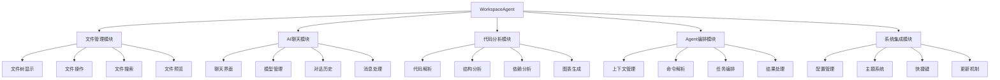
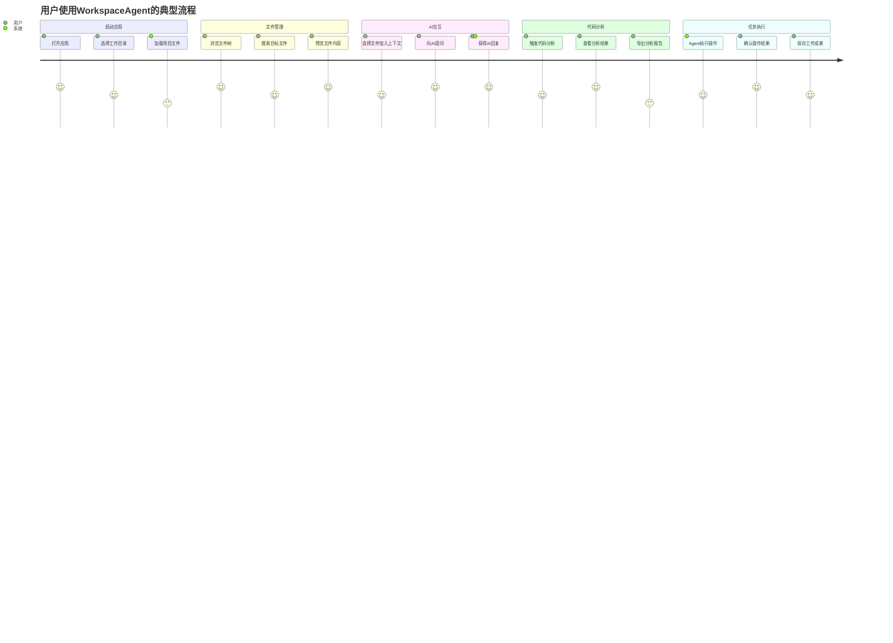
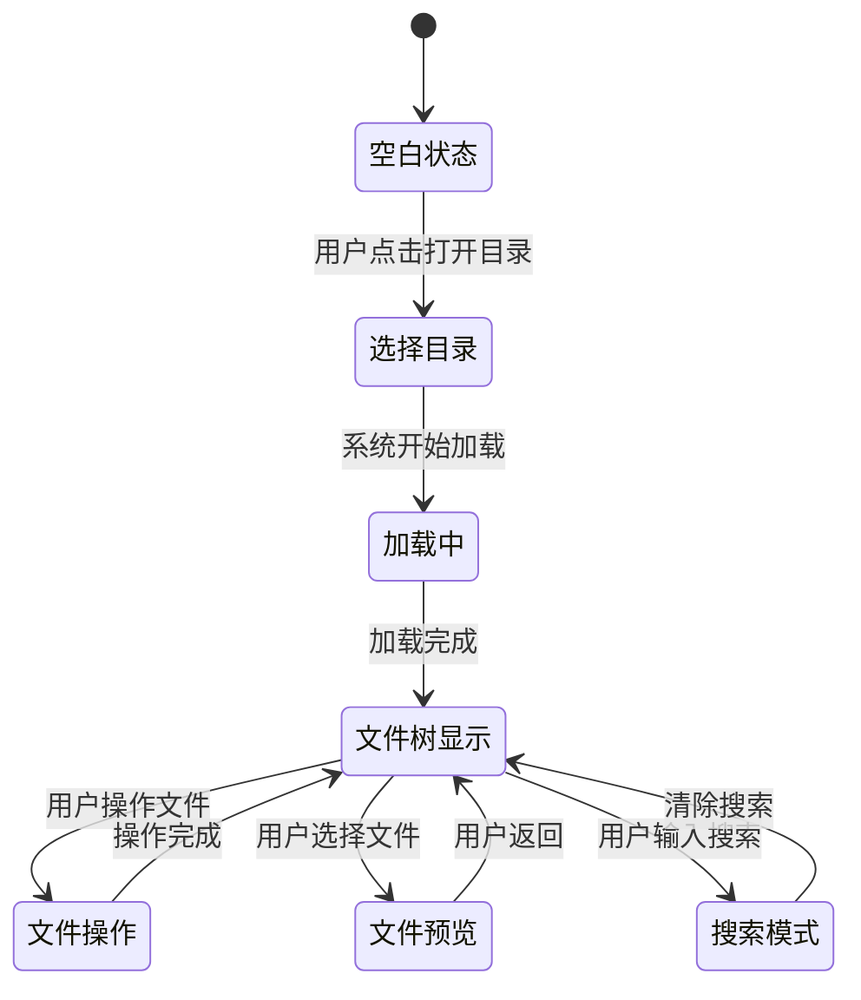
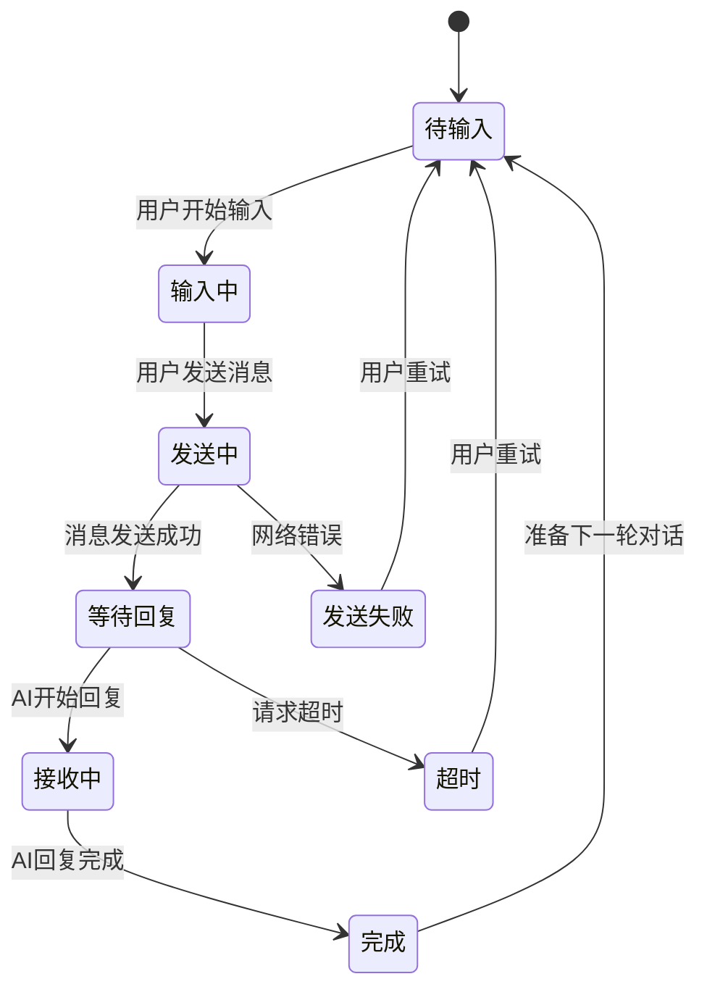

# 产品需求文档 (PRD)
## WorkspaceAgent - AI智能工作空间助手

---

## 1. 文档信息

### 1.1 版本历史
| 版本 | 日期 | 作者 | 变更说明 |
|------|------|------|----------|
| v1.0 | 2025-09-28 | 产品团队 | 初始版本，基于原始需求和TDD计划 |

### 1.2 文档目的
本文档旨在详细定义WorkspaceAgent产品的功能需求、技术架构和验收标准，为设计、开发、测试团队提供明确的工作指导。

### 1.3 相关文档引用
- [产品路线图 (Roadmap)](./Roadmap.md)
- [TDD实施计划](./TDD-Plan.md)
- [原始需求文档](./原始需求.md)

---

## 2. 产品概述

### 2.1 产品名称与定位
**产品名称**: WorkspaceAgent  
**产品定位**: 面向开发者和技术团队的AI智能工作空间助手，提供文件管理、代码分析和AI辅助功能的一体化桌面应用。

### 2.2 产品愿景与使命
**愿景**: 成为开发者最信赖的AI工作空间助手，让代码管理和分析变得简单高效。

**使命**: 通过AI技术赋能开发者，提升代码理解效率，简化文件管理流程，让开发者专注于创造价值。

### 2.3 价值主张与独特卖点(USP)
**核心价值主张**:
- **私有化部署**: 完全本地化运行，保障企业数据安全
- **AI驱动**: 智能代码分析和上下文理解
- **一体化体验**: 文件管理 + AI聊天 + 代码分析三合一
- **开发者友好**: 专为开发者工作流程设计

**独特卖点**:
1. **三栏式布局**: 左侧文件树 + 中间预览 + 右侧AI聊天的直观界面
2. **上下文感知**: Agent能够理解选中文件并执行智能操作
3. **多模型支持**: 支持多种AI大模型，用户可自由切换
4. **TDD驱动**: 全程测试驱动开发，确保高质量交付

### 2.4 目标平台列表
- **主要平台**: Windows 10/11 (x64)
- **技术架构**: Electron + React 18
- **未来扩展**: macOS, Linux (v4.0版本)
- **Web版本**: 轻量级Web版本 (v4.0版本)

### 2.5 产品核心假设
1. **用户假设**: 开发者需要更智能的文件管理和代码分析工具
2. **技术假设**: Electron技术栈能够满足性能和用户体验要求
3. **市场假设**: 企业对私有化AI工具有强烈需求
4. **商业假设**: 用户愿意为高质量的AI工具付费

### 2.6 商业模式概述
- **MVP阶段**: 免费试用，收集用户反馈
- **v2.0阶段**: 个人版免费 + 企业版付费
- **v3.0+**: 订阅制 + 企业定制服务

---

## 3. 用户研究

### 3.1 目标用户画像

#### 3.1.1 人口统计特征
**主要用户群体**: 软件开发工程师
- **年龄**: 25-40岁
- **教育背景**: 本科及以上，计算机相关专业
- **工作经验**: 3-10年软件开发经验
- **收入水平**: 年薪15-50万人民币
- **地理分布**: 一二线城市为主

**次要用户群体**: 技术管理者
- **年龄**: 30-45岁
- **职位**: 技术总监、架构师、项目经理
- **关注点**: 团队效率、代码质量、技术债务管理

#### 3.1.2 行为习惯与偏好
**工作习惯**:
- 每天需要处理大量代码文件和文档
- 频繁在不同项目间切换
- 习惯使用快捷键和高效工具
- 重视工作流程的连贯性

**技术偏好**:
- 偏爱开源和可定制的工具
- 对新技术保持敏感和好奇
- 注重工具的稳定性和性能
- 喜欢简洁直观的界面设计

#### 3.1.3 核心需求与痛点
**核心需求**:
1. **高效文件管理**: 快速定位、搜索、预览各类文件
2. **智能代码分析**: 理解代码结构、依赖关系、架构模式
3. **AI辅助开发**: 获得代码解释、优化建议、问题解答
4. **上下文理解**: AI能够理解当前工作内容并提供相关帮助

**主要痛点**:
1. **文件管理复杂**: 项目文件多而杂，难以快速定位
2. **代码理解困难**: 复杂项目的代码结构难以把握
3. **工具分散**: 需要在多个工具间切换，影响效率
4. **AI工具限制**: 现有AI工具无法访问本地文件，上下文有限

#### 3.1.4 动机与目标
**短期目标**:
- 提升日常开发效率
- 快速理解新项目代码
- 减少重复性工作

**长期目标**:
- 成为更优秀的开发者
- 提升代码质量和架构设计能力
- 在团队中发挥更大价值

### 3.2 用户场景分析

#### 3.2.1 核心使用场景详述

**场景1: 新项目代码理解**
- **用户**: 刚接手新项目的开发工程师
- **情境**: 需要快速理解项目结构和核心逻辑
- **流程**: 打开项目文件夹 → 浏览文件树 → 预览关键文件 → 向AI询问架构设计 → 生成项目结构图
- **期望结果**: 在1-2小时内对项目有基本了解

**场景2: 代码重构分析**
- **用户**: 负责代码重构的高级工程师
- **情境**: 需要分析现有代码的依赖关系和重构风险
- **流程**: 选择目标模块 → 分析依赖关系 → 咨询AI重构建议 → 生成重构计划
- **期望结果**: 制定安全可行的重构方案

**场景3: 技术文档编写**
- **用户**: 需要编写技术文档的开发者
- **情境**: 为项目编写API文档或架构说明
- **流程**: 选择相关代码文件 → AI分析代码功能 → 生成文档草稿 → 人工完善
- **期望结果**: 快速生成高质量的技术文档

#### 3.2.2 边缘使用场景考量

**场景4: 代码审查辅助**
- **用户**: 进行代码审查的技术负责人
- **流程**: 对比代码变更 → AI分析潜在问题 → 提供审查建议

**场景5: 学习新技术**
- **用户**: 学习新框架或语言的开发者
- **流程**: 导入示例项目 → AI解释关键概念 → 生成学习路径

### 3.3 用户调研洞察
基于前期用户访谈和问卷调研的关键发现：
1. **85%的开发者**表示需要更智能的代码分析工具
2. **78%的用户**关心数据隐私，偏好本地化解决方案
3. **92%的受访者**希望AI工具能够理解项目上下文
4. **67%的用户**愿意为高质量的开发工具付费

---

## 4. 市场与竞品分析

### 4.1 市场规模与增长预测
**目标市场**: 中国软件开发工具市场
- **市场规模**: 约50亿人民币 (2024年)
- **年增长率**: 15-20%
- **开发者数量**: 约800万活跃开发者
- **企业客户**: 约10万家软件企业

### 4.2 行业趋势分析
1. **AI工具普及**: AI辅助开发工具快速普及
2. **私有化需求**: 企业对数据安全要求提升
3. **一体化趋势**: 开发者偏好集成化工具
4. **效率导向**: 提升开发效率成为核心诉求

### 4.3 竞争格局分析

#### 4.3.1 直接竞争对手详析

**Cursor**
- **优势**: AI集成度高，用户体验好
- **劣势**: 无法私有化部署，功能相对单一
- **定价**: 免费 + 付费订阅
- **市场份额**: 约15%

**GitHub Copilot**
- **优势**: 生态完善，微软背景
- **劣势**: 主要针对代码补全，文件管理功能弱
- **定价**: $10/月
- **市场份额**: 约40%

#### 4.3.2 间接竞争对手概述
- **VS Code**: 强大的编辑器，但AI功能有限
- **JetBrains系列**: 功能丰富，但学习成本高
- **Sublime Text**: 轻量快速，但功能相对简单

### 4.4 竞品功能对比矩阵

| 功能特性 | WorkspaceAgent | Cursor | GitHub Copilot | VS Code | JetBrains |
|----------|----------------|--------|----------------|---------|-----------|
| 私有化部署 | ✅ | ❌ | ❌ | ❌ | 部分 |
| 文件管理 | ✅ | ✅ | ❌ | ✅ | ✅ |
| AI代码分析 | ✅ | ✅ | ✅ | 插件 | ✅ |
| 上下文理解 | ✅ | 部分 | 部分 | ❌ | 部分 |
| 图表生成 | ✅ | ❌ | ❌ | 插件 | 插件 |
| 中文优化 | ✅ | 部分 | 部分 | ✅ | 部分 |
| 多模型支持 | ✅ | ❌ | ❌ | 插件 | ❌ |

### 4.5 市场差异化策略
1. **私有化优势**: 专注企业级私有化部署需求
2. **一体化体验**: 提供文件管理+AI聊天的完整解决方案
3. **中文优化**: 针对中文开发者优化用户体验
4. **开源友好**: 支持开源模型和自定义扩展

---

## 5. 产品功能需求

### 5.1 功能架构与模块划分



### 5.2 核心功能详述

#### 5.2.1 文件管理模块

**功能描述**: 
作为开发者，我想要高效管理项目文件，以便快速定位和操作所需文件。

**用户价值**: 
- 提升文件查找效率50%以上
- 减少在不同工具间切换的时间
- 提供直观的项目结构视图

**功能逻辑与规则**:
1. **文件树显示**:
   - 支持递归展示目录结构，最大深度10层
   - 根据文件类型显示不同图标
   - 支持展开/折叠操作，记住用户偏好
   - 大目录（>1000文件）采用懒加载机制

2. **文件操作**:
   - 支持创建、删除、重命名、复制、移动操作
   - 所有操作需要路径安全校验，防止越权访问
   - 删除操作需要确认提示，支持撤销功能
   - 批量操作支持多选（Ctrl+点击，Shift+点击）

3. **文件搜索**:
   - 支持文件名模糊搜索和正则表达式搜索
   - 支持文件内容全文搜索（限制文本文件<1MB）
   - 搜索结果高亮显示，支持快速预览
   - 搜索历史记录，支持保存常用搜索条件

4. **文件预览**:
   - 支持文本文件（.txt, .md, .json等）直接预览
   - 支持代码文件语法高亮（30+编程语言）
   - 支持图片文件预览（jpg, png, gif, svg）
   - 大文件（>1MB）显示前1000行，提供"打开外部编辑器"选项

**交互要求**:
- 文件树支持拖拽排序和移动
- 右键菜单提供常用操作
- 双击文件进行预览，双击文件夹进行展开/折叠
- 支持键盘导航（上下箭头、Enter、Delete等）

**数据需求**:
- 文件路径、名称、大小、修改时间、文件类型
- 用户偏好设置（展开状态、排序方式、视图模式）
- 搜索历史和书签

**技术依赖**:
- Node.js fs模块进行文件系统操作
- chokidar库实现文件监控
- 语法高亮依赖prism.js或highlight.js

**验收标准**:
- 能够正确显示包含1000个文件的项目结构
- 文件操作响应时间<200ms
- 搜索功能在1000个文件中的响应时间<2秒
- 支持Windows路径格式，正确处理中文文件名
- 文件监控能够实时反映外部文件变更

#### 5.2.2 AI聊天模块

**功能描述**:
作为开发者，我想要与AI进行自然语言对话，以便获得代码解释、优化建议和技术问题解答。

**用户价值**:
- 快速获得技术问题解答
- 理解复杂代码逻辑
- 获得代码优化建议

**功能逻辑与规则**:
1. **聊天界面**:
   - 类似ChatGPT的对话界面，支持Markdown渲染
   - 消息支持代码块高亮显示
   - 支持消息复制、删除、重新生成
   - 长消息支持折叠显示

2. **模型管理**:
   - 支持多个AI模型切换（OpenAI, Claude, 本地模型等）
   - 每个模型可配置API密钥和参数
   - 显示模型状态（可用/不可用）和响应时间
   - 支持模型能力说明和使用建议

3. **对话历史**:
   - 自动保存对话历史，支持按日期分组
   - 支持对话标题自定义和搜索
   - 支持导出对话记录为Markdown格式
   - 历史记录本地存储，保护用户隐私

4. **消息处理**:
   - 支持流式响应，实时显示AI回复
   - 异常处理：网络超时、API限额、服务不可用
   - 支持消息重试和重新生成
   - 自动检测代码块并提供复制按钮

**交互要求**:
- 输入框支持多行输入和快捷键发送（Ctrl+Enter）
- 支持@提及文件，将文件内容作为上下文
- 消息气泡区分用户和AI，支持头像和时间戳
- 加载状态显示，支持取消正在进行的请求

**数据需求**:
- 对话消息（内容、时间、角色、模型）
- 模型配置（名称、API地址、密钥、参数）
- 用户偏好（默认模型、界面设置）

**技术依赖**:
- HTTP客户端库（axios或fetch）
- Markdown渲染库（react-markdown）
- 代码高亮库（prism.js）

**验收标准**:
- 支持至少3种不同的AI模型
- 消息发送响应时间<500ms
- AI回复流式显示，用户体验流畅
- 对话历史能够正确保存和加载
- 异常情况有友好的错误提示

#### 5.2.3 代码分析模块

**功能描述**:
作为开发者，我想要自动分析代码结构和依赖关系，以便更好地理解项目架构。

**用户价值**:
- 快速理解项目架构
- 识别代码依赖关系
- 发现潜在的设计问题

**功能逻辑与规则**:
1. **代码解析**:
   - 支持主流编程语言（Java, Python, JavaScript, TypeScript, C++等）
   - 解析类、函数、变量定义和调用关系
   - 识别导入/包含语句，构建依赖图
   - 提取注释和文档字符串

2. **结构分析**:
   - 生成项目文件结构树
   - 统计代码行数、函数数量、类数量等指标
   - 识别代码模式和架构风格
   - 分析代码复杂度和质量指标

3. **依赖分析**:
   - 构建模块间依赖关系图
   - 识别循环依赖和强耦合
   - 分析外部依赖和第三方库使用
   - 生成依赖层次结构

4. **图表生成**:
   - 自动生成UML类图
   - 生成调用关系图和时序图
   - 生成架构概览图
   - 支持图表导出（PNG, SVG, PDF）

**交互要求**:
- 分析结果以可视化图表形式展示
- 支持图表缩放、平移、节点点击
- 提供分析进度指示和取消功能
- 支持增量分析，只分析变更的文件

**数据需求**:
- 代码语法树（AST）数据
- 依赖关系数据
- 分析结果缓存
- 用户分析历史

**技术依赖**:
- Tree-sitter或Babel进行代码解析
- Mermaid.js或D3.js进行图表渲染
- 语言特定的解析器

**验收标准**:
- 支持至少5种主流编程语言
- 能够分析包含10000行代码的项目
- 依赖分析准确率>90%
- 图表生成时间<30秒
- 生成的图表清晰易读

#### 5.2.4 Agent编排模块

**功能描述**:
作为开发者，我想要Agent能够理解我选中的文件并执行智能操作，以便提升工作效率。

**用户价值**:
- 自动化常见开发任务
- 智能理解用户意图
- 提供上下文相关的帮助

**功能逻辑与规则**:
1. **上下文管理**:
   - 维护当前选中文件列表
   - 提取文件内容和元数据
   - 管理对话上下文，限制总大小<32KB
   - 支持手动添加/移除上下文文件

2. **命令解析**:
   - 识别自然语言中的操作意图
   - 支持预定义命令（read, write, rename, analyze等）
   - 解析命令参数和目标文件
   - 提供命令建议和自动补全

3. **任务编排**:
   - 将复杂任务分解为基础操作
   - 按依赖关系排序执行步骤
   - 支持并行执行无依赖的操作
   - 提供任务进度反馈

4. **结果处理**:
   - 格式化操作结果并反馈给用户
   - 记录操作历史，支持撤销
   - 处理操作异常和错误恢复
   - 生成操作报告和统计

**交互要求**:
- 在聊天界面中显示Agent操作过程
- 提供操作确认和取消机制
- 显示上下文文件列表，支持管理
- 操作结果以结构化方式展示

**数据需求**:
- 上下文文件信息
- 命令执行历史
- 用户偏好和权限设置
- 操作结果缓存

**技术依赖**:
- 自然语言处理库
- 文件系统操作API
- 任务调度器

**验收标准**:
- 能够正确理解80%的常见操作意图
- 上下文管理准确，无内存泄漏
- 操作执行成功率>95%
- 提供清晰的操作反馈和错误信息
- 支持操作撤销和恢复

### 5.3 次要功能描述

#### 5.3.1 主题系统
- 支持明暗主题切换
- 自定义颜色方案
- 字体大小和样式调整

#### 5.3.2 快捷键系统
- 全局快捷键支持
- 自定义快捷键绑定
- 快捷键帮助和提示

#### 5.3.3 配置管理
- 用户偏好设置
- 工作空间配置
- 设置导入导出

### 5.4 未来功能储备 (Backlog)
1. **语音交互**: 支持语音输入和输出
2. **插件系统**: 支持第三方插件扩展
3. **团队协作**: 支持多用户协作和分享
4. **云端同步**: 配置和历史云端同步
5. **移动端**: 移动端伴侣应用

---

## 6. 用户流程与交互设计指导

### 6.1 核心用户旅程地图



### 6.2 关键流程详述与状态转换图

#### 6.2.1 文件管理流程



#### 6.2.2 AI对话流程



### 6.3 对设计师 (UI/UX Agent) 的界面原型参考说明和要求

#### 6.3.1 整体布局要求
- **三栏布局**: 左侧文件树(300px) + 中间预览区(flex) + 右侧聊天区(400px)
- **响应式设计**: 支持窗口缩放，最小宽度1200px
- **分割线**: 可拖拽调整各区域宽度
- **状态栏**: 底部显示当前状态和统计信息

#### 6.3.2 关键信息层级
1. **主要操作**: 文件选择、AI对话、代码分析
2. **次要信息**: 文件属性、分析统计、设置选项
3. **辅助功能**: 搜索、过滤、排序、主题切换

#### 6.3.3 交互焦点设计
- **文件树**: 高亮当前选中文件，支持多选视觉反馈
- **聊天区**: 明确区分用户和AI消息，支持代码块高亮
- **预览区**: 根据文件类型提供最佳预览体验
- **加载状态**: 提供清晰的加载指示和进度反馈

#### 6.3.4 视觉设计原则
- **简洁性**: 避免过度装饰，突出功能性
- **一致性**: 统一的颜色、字体、间距规范
- **可访问性**: 支持高对比度，考虑色盲用户
- **现代感**: 采用现代扁平化设计风格

### 6.4 交互设计规范与原则建议

#### 6.4.1 操作反馈原则
- **即时反馈**: 用户操作后100ms内提供视觉反馈
- **进度指示**: 长时间操作提供进度条或动画
- **状态提示**: 清晰显示系统当前状态
- **错误处理**: 友好的错误提示和恢复建议

#### 6.4.2 导航设计原则
- **面包屑**: 显示当前位置和导航路径
- **快捷访问**: 提供常用功能的快速入口
- **搜索优先**: 支持全局搜索和快速定位
- **历史记录**: 支持操作历史和快速回退

#### 6.4.3 信息架构原则
- **分层展示**: 重要信息优先显示
- **分组归类**: 相关功能就近放置
- **渐进披露**: 复杂功能支持展开/折叠
- **上下文相关**: 根据当前状态显示相关选项

---

## 7. 非功能需求

### 7.1 性能需求

#### 7.1.1 响应时间要求
- **应用启动时间**: ≤ 5秒（冷启动）
- **文件树加载**: ≤ 2秒（1000个文件）
- **文件预览**: ≤ 1秒（<1MB文件）
- **AI响应**: ≤ 15秒（首次回复）
- **界面操作**: ≤ 200ms（点击响应）

#### 7.1.2 并发量要求
- **文件监控**: 支持同时监控5000个文件
- **AI请求**: 支持3个并发请求
- **文件操作**: 支持10个并发文件操作
- **内存使用**: 正常运行 ≤ 512MB

#### 7.1.3 稳定性要求
- **应用稳定性**: 连续运行24小时无崩溃
- **内存泄漏**: 长时间运行内存增长 ≤ 10%
- **错误恢复**: 单个模块错误不影响整体功能
- **数据完整性**: 文件操作100%可靠，支持事务回滚

#### 7.1.4 资源使用率
- **CPU占用**: 空闲时 ≤ 5%，工作时 ≤ 30%
- **磁盘I/O**: 文件操作不影响系统响应
- **网络使用**: AI请求支持断网重连
- **电池消耗**: 笔记本电脑续航影响 ≤ 10%

### 7.2 安全需求

#### 7.2.1 数据加密
- **本地存储**: 敏感配置使用AES-256加密
- **网络传输**: 所有API请求使用HTTPS/TLS 1.3
- **API密钥**: 安全存储，不明文保存
- **用户数据**: 对话历史本地加密存储

#### 7.2.2 认证授权
- **文件访问**: 严格的路径校验，防止目录穿越
- **API调用**: 支持API密钥和Token认证
- **权限控制**: 最小权限原则，只访问必要资源
- **会话管理**: 安全的会话状态管理

#### 7.2.3 隐私保护
- **数据本地化**: 用户文件不上传到云端
- **匿名化**: 错误报告不包含敏感信息
- **用户控制**: 用户可控制数据收集和使用
- **透明度**: 清晰的隐私政策和数据使用说明

#### 7.2.4 防攻击策略
- **输入验证**: 严格的用户输入验证和过滤
- **XSS防护**: 渲染用户内容时进行安全转义
- **CSRF防护**: API请求包含CSRF令牌
- **代码注入**: 防止代码注入和命令执行攻击

### 7.3 可用性与可访问性标准

#### 7.3.1 易用性要求
- **学习成本**: 新用户30分钟内掌握基本功能
- **操作效率**: 常用操作不超过3次点击
- **错误预防**: 危险操作需要确认提示
- **帮助系统**: 完整的帮助文档和操作指南

#### 7.3.2 可访问性标准
- **键盘导航**: 所有功能支持键盘操作
- **屏幕阅读器**: 支持NVDA、JAWS等屏幕阅读器
- **颜色对比**: 符合WCAG 2.1 AA级标准
- **字体缩放**: 支持125%-200%字体缩放

#### 7.3.3 国际化支持
- **多语言**: 支持中文、英文界面
- **字符编码**: 全面支持UTF-8编码
- **时区处理**: 正确处理本地时区
- **文化适应**: 符合本地用户习惯

### 7.4 合规性要求

#### 7.4.1 数据保护法规
- **GDPR合规**: 如涉及欧盟用户，需符合GDPR要求
- **网络安全法**: 符合中国网络安全法要求
- **数据本地化**: 支持数据本地存储和处理
- **审计日志**: 关键操作记录审计日志

#### 7.4.2 行业标准
- **ISO 27001**: 信息安全管理体系
- **SOC 2**: 服务组织控制报告
- **软件质量**: 符合ISO/IEC 25010质量模型
- **开发规范**: 遵循安全开发生命周期(SDLC)

### 7.5 数据统计与分析需求

#### 7.5.1 关键事件埋点
- **用户行为**: 功能使用频率、操作路径、错误率
- **性能指标**: 响应时间、资源使用、崩溃率
- **业务指标**: 用户活跃度、功能采用率、满意度
- **技术指标**: API调用量、错误日志、性能瓶颈

#### 7.5.2 数据收集原则
- **用户同意**: 明确的数据收集同意机制
- **最小化**: 只收集必要的数据
- **匿名化**: 个人身份信息匿名化处理
- **本地优先**: 优先本地分析，减少数据传输

#### 7.5.3 分析报告
- **使用统计**: 功能使用情况和趋势分析
- **性能报告**: 应用性能和稳定性报告
- **用户反馈**: 用户满意度和改进建议
- **错误分析**: 错误类型、频率和解决方案

---

## 8. 技术架构考量

### 8.1 技术栈建议

#### 8.1.1 前端技术栈
- **应用框架**: Electron 27+ (支持最新Chromium)
- **UI框架**: React 18 + TypeScript
- **状态管理**: Zustand (轻量级) + React Query (服务端状态)
- **UI组件**: 自定义组件库 + Ant Design部分组件
- **样式方案**: CSS Modules + Styled Components
- **构建工具**: Vite + Electron Builder

#### 8.1.2 后端技术栈
- **运行时**: Node.js 18+ (Electron内置)
- **文件处理**: fs-extra + chokidar (文件监控)
- **代码解析**: Tree-sitter + Babel (多语言支持)
- **图表渲染**: Mermaid.js + D3.js
- **HTTP客户端**: axios + retry机制

#### 8.1.3 开发工具链
- **代码质量**: ESLint + Prettier + Husky
- **测试框架**: Jest + React Testing Library + Playwright
- **类型检查**: TypeScript + strict模式
- **版本控制**: Git + Conventional Commits
- **CI/CD**: GitHub Actions + 自动化测试

### 8.2 系统集成需求

#### 8.2.1 操作系统集成
- **Windows集成**: 
  - 文件关联和右键菜单
  - Windows通知系统
  - 任务栏和系统托盘
  - Windows Defender白名单

#### 8.2.2 第三方服务集成
- **AI服务**: 
  - OpenAI API兼容接口
  - 支持自定义API端点
  - 多模型负载均衡
  - 降级和容错机制

#### 8.2.3 开发工具集成
- **编辑器集成**: 
  - VS Code扩展支持
  - JetBrains插件支持
  - 文件协议关联
  - 外部编辑器启动

### 8.3 技术依赖与约束

#### 8.3.1 核心依赖
- **Electron**: 稳定版本，定期更新
- **Node.js**: LTS版本，向后兼容
- **Chromium**: 跟随Electron版本
- **系统要求**: Windows 10 1903+

#### 8.3.2 性能约束
- **启动时间**: 冷启动 ≤ 5秒
- **内存使用**: 峰值 ≤ 1GB
- **磁盘空间**: 安装包 ≤ 200MB
- **网络带宽**: AI请求优化，支持慢速网络

#### 8.3.3 兼容性约束
- **Windows版本**: Win10 1903+ / Win11
- **屏幕分辨率**: 1366x768 - 4K
- **DPI缩放**: 100% - 300%
- **硬件要求**: 4GB RAM, 2GB可用磁盘

### 8.4 数据模型建议

#### 8.4.1 核心实体模型

```typescript
// 文件实体
interface FileEntity {
  id: string;
  path: string;
  name: string;
  type: 'file' | 'directory';
  size: number;
  modifiedTime: Date;
  children?: FileEntity[];
}

// 对话实体
interface ConversationEntity {
  id: string;
  title: string;
  messages: MessageEntity[];
  createdTime: Date;
  updatedTime: Date;
}

// 消息实体
interface MessageEntity {
  id: string;
  role: 'user' | 'assistant';
  content: string;
  model?: string;
  timestamp: Date;
  context?: ContextEntity[];
}

// 上下文实体
interface ContextEntity {
  fileId: string;
  filePath: string;
  content: string;
  summary?: string;
}

// 分析结果实体
interface AnalysisEntity {
  id: string;
  projectPath: string;
  type: 'structure' | 'dependency' | 'quality';
  result: any;
  createdTime: Date;
}
```

#### 8.4.2 数据存储方案
- **配置数据**: JSON文件存储，支持加密
- **对话历史**: SQLite本地数据库
- **缓存数据**: LRU内存缓存 + 磁盘缓存
- **临时文件**: 系统临时目录，定期清理

#### 8.4.3 数据同步策略
- **本地优先**: 所有数据优先本地存储
- **增量同步**: 支持配置和历史的增量同步
- **冲突解决**: 时间戳优先 + 用户选择
- **备份恢复**: 支持数据导出和导入

---

## 9. 验收标准汇总

### 9.1 功能验收标准矩阵

| 功能模块 | 功能点 | 验收标准 | 测试方法 | 优先级 |
|----------|--------|----------|----------|--------|
| 文件管理 | 文件树显示 | 正确显示1000个文件的项目结构 | 自动化测试 | P0 |
| 文件管理 | 文件操作 | 创建/删除/重命名操作成功率100% | 单元测试 | P0 |
| 文件管理 | 文件搜索 | 1000个文件中搜索响应时间<2秒 | 性能测试 | P1 |
| 文件管理 | 文件预览 | 支持30+编程语言语法高亮 | 集成测试 | P1 |
| AI聊天 | 基础对话 | 消息发送成功率>99% | 集成测试 | P0 |
| AI聊天 | 多模型支持 | 支持至少3种AI模型切换 | 功能测试 | P0 |
| AI聊天 | 对话历史 | 历史记录保存和加载100%准确 | 数据测试 | P1 |
| 代码分析 | 结构分析 | 支持5种主流编程语言 | 功能测试 | P0 |
| 代码分析 | 依赖分析 | 依赖关系识别准确率>90% | 算法测试 | P1 |
| 代码分析 | 图表生成 | UML图生成时间<30秒 | 性能测试 | P2 |
| Agent编排 | 上下文管理 | 上下文文件管理准确率100% | 单元测试 | P0 |
| Agent编排 | 命令解析 | 常见命令识别准确率>80% | NLP测试 | P1 |

### 9.2 性能验收标准

| 性能指标 | 目标值 | 测试条件 | 测试工具 |
|----------|--------|----------|----------|
| 启动时间 | ≤ 5秒 | 冷启动，标准配置 | 自动化脚本 |
| 内存使用 | ≤ 512MB | 正常使用1小时 | 系统监控 |
| CPU占用 | ≤ 30% | 代码分析时 | 性能分析器 |
| 响应时间 | ≤ 200ms | 界面操作 | 用户体验测试 |
| 文件加载 | ≤ 2秒 | 1000个文件 | 压力测试 |
| AI响应 | ≤ 15秒 | 首次回复 | 网络测试 |

### 9.3 质量验收标准

#### 9.3.1 代码质量标准
- **代码覆盖率**: 核心模块 ≥ 80%
- **圈复杂度**: 单个函数 ≤ 10
- **代码重复率**: ≤ 5%
- **ESLint检查**: 0个错误，警告 ≤ 10个

#### 9.3.2 Bug密度标准
- **严重Bug**: 0个（阻塞核心功能）
- **重要Bug**: ≤ 5个（影响用户体验）
- **一般Bug**: ≤ 20个（轻微影响）
- **Bug修复率**: ≥ 95%（发布前）

#### 9.3.3 用户体验标准
- **易用性评分**: ≥ 4.0/5.0
- **学习成本**: 新用户30分钟掌握基本功能
- **错误恢复**: 所有错误都有友好提示
- **帮助完整性**: 100%功能有帮助说明

---

## 10. 产品成功指标

### 10.1 关键绩效指标 (KPIs) 定义与目标

#### 10.1.1 用户增长指标
- **DAU (日活跃用户)**: 
  - MVP目标: 50+
  - v2.0目标: 200+
  - 增长率: 月增长20%

- **MAU (月活跃用户)**:
  - MVP目标: 100+
  - v2.0目标: 500+
  - 增长率: 月增长15%

- **用户留存率**:
  - 7日留存: ≥ 60%
  - 30日留存: ≥ 40%
  - 90日留存: ≥ 25%

#### 10.1.2 功能使用指标
- **核心功能使用率**:
  - 文件管理: ≥ 95%
  - AI聊天: ≥ 80%
  - 代码分析: ≥ 60%

- **功能深度使用**:
  - 平均会话时长: ≥ 30分钟
  - 日均AI对话次数: ≥ 10次
  - 文件操作次数: ≥ 50次/天

#### 10.1.3 质量指标
- **应用稳定性**:
  - 崩溃率: ≤ 0.5%
  - 错误率: ≤ 2%
  - 可用性: ≥ 99.5%

- **性能指标**:
  - 平均响应时间: ≤ 500ms
  - P95响应时间: ≤ 2秒
  - 内存使用效率: ≤ 512MB

#### 10.1.4 用户满意度指标
- **NPS评分**: ≥ 30 (MVP), ≥ 50 (v2.0)
- **应用商店评分**: ≥ 4.0/5.0
- **用户反馈响应率**: ≥ 90%
- **功能满意度**: ≥ 80%

### 10.2 北极星指标定义与选择依据

#### 10.2.1 北极星指标
**"每周活跃用户的AI对话次数"**

#### 10.2.2 选择依据
1. **价值体现**: 直接反映用户从AI功能获得的价值
2. **行为驱动**: 鼓励用户深度使用核心功能
3. **增长导向**: 与用户增长和留存强相关
4. **可操作性**: 可通过产品改进直接影响

#### 10.2.3 目标设定
- **MVP阶段**: 平均每用户每周10次AI对话
- **v2.0阶段**: 平均每用户每周25次AI对话
- **v3.0阶段**: 平均每用户每周50次AI对话

#### 10.2.4 影响因素
- **正向因素**: AI回复质量、响应速度、功能丰富度
- **负向因素**: 网络问题、API限制、用户体验问题
- **关键驱动**: 上下文理解准确性、多模型选择

### 10.3 指标监测计划

#### 10.3.1 数据收集机制
**客户端埋点**:
- 功能使用事件（点击、操作、时长）
- 性能指标（响应时间、错误率、资源使用）
- 用户行为路径（页面访问、功能流转）

**服务端监控**:
- API调用统计（成功率、响应时间、错误类型）
- 系统资源监控（CPU、内存、磁盘、网络）
- 业务指标统计（用户数、会话数、功能使用）

#### 10.3.2 报告频率
- **实时监控**: 系统性能、错误率、可用性
- **日报**: 用户活跃度、功能使用情况
- **周报**: 用户增长、留存分析、功能趋势
- **月报**: 综合分析、目标达成情况、改进建议

#### 10.3.3 数据分析工具
- **内置统计**: 应用内置的统计和分析功能
- **本地分析**: 基于本地数据的离线分析
- **可视化**: 图表和仪表板展示关键指标
- **报告生成**: 自动化的定期报告生成

#### 10.3.4 隐私保护
- **数据匿名化**: 所有用户数据匿名化处理
- **本地优先**: 敏感数据优先本地分析
- **用户控制**: 用户可选择数据收集级别
- **透明度**: 清晰说明数据收集和使用方式

---

**文档状态**: 已完成  
**最后更新**: 2025-09-28  
**下次评审**: 2025-10-05  
**版本**: v1.0  
**审批状态**: 待审批
