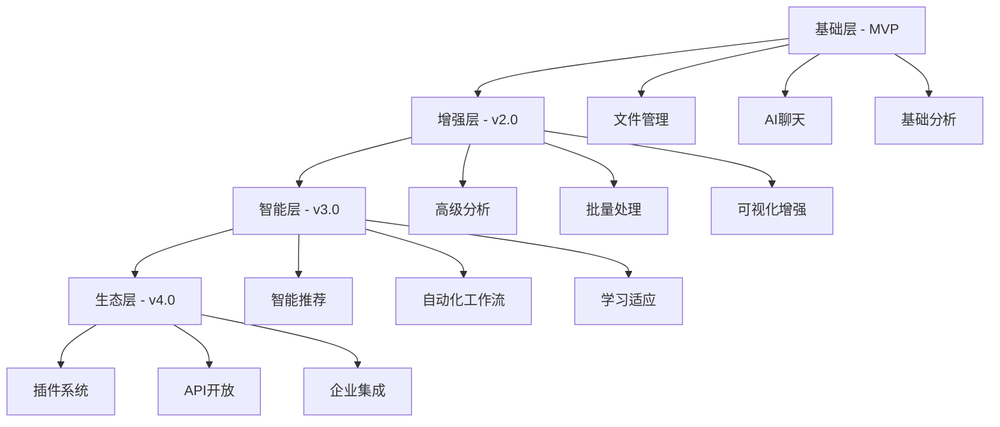
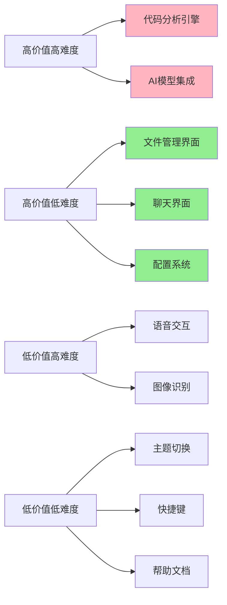
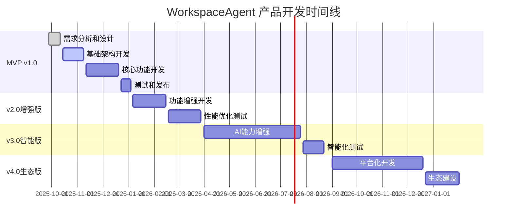
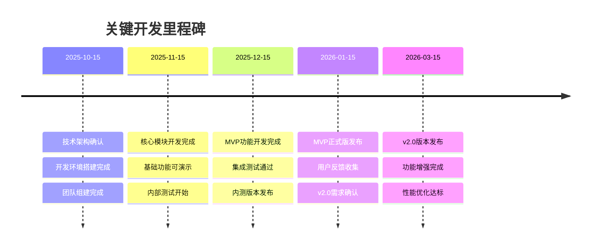
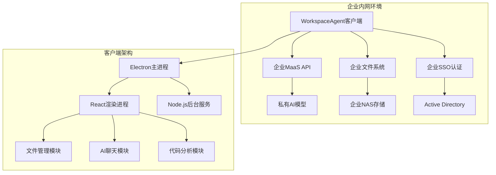

# 产品路线图 (Roadmap)
## WorkspaceAgent - AI智能工作空间助手

---

## 1. 路线图概述

### 1.1 产品发展战略
WorkspaceAgent采用渐进式发展策略，从MVP版本开始，逐步构建完整的AI工作空间生态系统。我们将优先实现核心功能，确保产品可用性和稳定性，然后逐步增强AI能力和用户体验。

### 1.2 版本发布节奏
- **快速迭代**: 每2-3个月发布一个主要版本
- **持续改进**: 每2周发布补丁和小功能更新
- **用户反馈驱动**: 基于用户反馈调整功能优先级
- **技术债务管理**: 每个版本预留20%时间处理技术债务

### 1.3 市场投放策略
- **内测阶段**: 选择3-5家友好企业进行内测
- **公测阶段**: 扩大到20-30家企业用户
- **正式发布**: 面向目标市场全面推广
- **生态建设**: 建立合作伙伴和开发者生态

---

## 2. 版本规划策略

### 2.1 MVP优先原则
遵循精益创业方法论，优先实现能够验证核心价值假设的最小功能集合：
- **核心价值验证**: AI辅助文件管理和代码分析
- **技术可行性验证**: 私有化部署和MaaS API集成
- **用户体验验证**: 左右分栏界面和自然语言交互

### 2.2 功能分层策略

### 2.3 技术演进路径
- **MVP**: 基于现有开源组件快速搭建
- **v2.0**: 优化性能，增强稳定性
- **v3.0**: 引入更先进的AI模型和算法
- **v4.0**: 构建开放平台和生态系统

---

## 3. 详细版本规划

### 3.1 MVP版本 (v1.0) - 核心功能验证
**发布时间**: 2025年12月  
**开发周期**: 3个月  
**核心目标**: 验证产品核心价值，实现基本可用的AI工作空间

#### 3.1.1 核心功能
**文件管理模块**
- ✅ 文件夹导入和树形显示
- ✅ 基本文件操作(创建、删除、重命名、复制)
- ✅ 文件搜索和过滤
- ✅ 常见文件格式预览

**AI聊天模块**
- ✅ 基础聊天界面和消息收发
- ✅ MaaS API集成和模型配置
- ✅ 对话历史保存和加载
- ✅ 基础错误处理和重试机制

**代码分析功能**
- ✅ 支持主流编程语言(Java, Python, JavaScript, C++)
- ✅ 基础代码结构分析
- ✅ 简单依赖关系图生成
- ✅ 代码统计和基础指标

**系统集成**
- ✅ Windows 11原生界面适配
- ✅ 基础配置管理
- ✅ 应用打包和安装程序

#### 3.1.2 技术实现
- **前端框架**: Electron + React 18
- **状态管理**: Zustand (轻量级)
- **UI组件**: 自定义组件 + Ant Design部分组件
- **代码解析**: Tree-sitter + 自定义解析器
- **图表渲染**: Mermaid.js

#### 3.1.3 验收标准
- 应用能够稳定运行，无崩溃
- 支持1000个文件的项目加载
- AI响应时间小于15秒
- 基本功能覆盖率达到80%

### 3.2 增强版本 (v2.0) - 功能完善
**发布时间**: 2026年3月  
**开发周期**: 3个月  
**核心目标**: 完善核心功能，提升用户体验和性能

#### 3.2.1 新增功能
**高级代码分析**
- 🔄 UML类图自动生成
- 🔄 时序图和流程图生成
- 🔄 代码质量评估和建议
- 🔄 架构模式识别

**文档智能处理**
- 🔄 批量文档翻译(英文→中文)
- 🔄 文档智能分类和归档
- 🔄 Markdown到HTML/PDF转换
- 🔄 文档摘要和关键词提取

**用户体验增强**
- 🔄 主题系统和界面定制
- 🔄 快捷键和操作优化
- 🔄 拖拽交互增强
- 🔄 多标签页支持

**性能优化**
- 🔄 大文件处理优化
- 🔄 内存使用优化
- 🔄 启动速度提升
- 🔄 响应性能改进

#### 3.2.2 技术升级
- **状态管理**: 升级到Redux Toolkit
- **UI框架**: 完善自定义设计系统
- **代码分析**: 集成更多语言支持
- **缓存系统**: 引入Redis缓存

#### 3.2.3 验收标准
- 支持5000个文件的大型项目
- AI响应时间优化到10秒以内
- 文档处理准确率达到85%
- 用户满意度NPS > 30

### 3.3 智能版本 (v3.0) - AI能力增强
**发布时间**: 2026年8月  
**开发周期**: 4个月  
**核心目标**: 大幅提升AI智能化水平，实现更自然的人机交互

#### 3.3.1 智能化功能
**智能推荐系统**
- 📋 基于使用习惯的功能推荐
- 📋 智能文件组织建议
- 📋 代码优化建议
- 📋 工作流程优化提示

**自动化工作流**
- 📋 可视化工作流编辑器
- 📋 常用任务自动化模板
- 📋 条件触发和批量执行
- 📋 工作流分享和导入

**上下文理解增强**
- 📋 多文件关联分析
- 📋 项目全局理解
- 📋 历史对话上下文保持
- 📋 智能意图识别

**多模态交互**
- 📋 语音输入和输出
- 📋 图像识别和分析
- 📋 手势操作支持
- 📋 自然语言命令执行

#### 3.3.2 AI模型升级
- **本地模型**: 集成轻量级本地AI模型
- **混合推理**: 本地+云端混合推理架构
- **模型微调**: 支持企业定制化模型训练
- **多模型支持**: 同时支持多个AI模型

#### 3.3.3 验收标准
- 智能推荐准确率达到70%
- 自动化任务成功率达到90%
- 语音识别准确率达到95%
- 用户效率提升达到50%

### 3.4 生态版本 (v4.0) - 平台化发展
**发布时间**: 2027年1月  
**开发周期**: 4个月  
**核心目标**: 构建开放生态，支持第三方扩展和企业级集成

#### 3.4.1 平台化功能
**插件系统**
- 🎯 标准化插件开发框架
- 🎯 插件市场和管理中心
- 🎯 热插拔和版本管理
- 🎯 插件安全沙箱

**API开放平台**
- 🎯 RESTful API接口
- 🎯 WebSocket实时通信
- 🎯 SDK和开发工具
- 🎯 API文档和示例

**企业级集成**
- 🎯 SSO单点登录集成
- 🎯 企业目录服务集成
- 🎯 权限管理和审计
- 🎯 数据备份和恢复

**多平台支持**
- 🎯 macOS版本开发
- 🎯 Linux版本支持
- 🎯 Web版本(轻量级)
- 🎯 移动端伴侣应用

#### 3.4.2 生态建设
- **开发者社区**: 建立活跃的开发者社区
- **合作伙伴计划**: 与企业软件厂商合作
- **认证体系**: 建立插件和集成认证标准
- **培训体系**: 提供完整的培训和认证课程

#### 3.4.3 验收标准
- 插件生态达到50+优质插件
- API调用量达到10万次/月
- 企业集成成功率达到95%
- 开发者社区活跃用户1000+

---

## 4. 功能优先级矩阵

### 4.1 优先级分类标准
- **P0 (必须有)**: 产品核心价值，缺少会导致产品无法使用
- **P1 (应该有)**: 重要功能，显著提升用户体验
- **P2 (可以有)**: 增值功能，锦上添花
- **P3 (暂不做)**: 未来考虑，当前版本不实现

### 4.2 MVP版本优先级矩阵

| 功能模块 | 具体功能 | 优先级 | 开发工作量 | 用户价值 | 技术风险 |
|----------|----------|--------|------------|----------|----------|
| 文件管理 | 文件树显示 | P0 | 中 | 高 | 低 |
| 文件管理 | 基本文件操作 | P0 | 中 | 高 | 低 |
| 文件管理 | 文件搜索 | P1 | 低 | 中 | 低 |
| 文件管理 | 文件预览 | P1 | 高 | 中 | 中 |
| AI聊天 | 基础聊天界面 | P0 | 中 | 高 | 低 |
| AI聊天 | MaaS API集成 | P0 | 高 | 高 | 高 |
| AI聊天 | 对话历史 | P1 | 低 | 中 | 低 |
| AI聊天 | 多模型支持 | P2 | 中 | 中 | 中 |
| 代码分析 | 基础结构分析 | P0 | 高 | 高 | 中 |
| 代码分析 | 依赖关系图 | P1 | 高 | 高 | 中 |
| 代码分析 | UML图生成 | P2 | 高 | 中 | 高 |
| 系统集成 | Windows适配 | P0 | 中 | 高 | 中 |
| 系统集成 | 配置管理 | P0 | 低 | 中 | 低 |
| 系统集成 | 自动更新 | P2 | 中 | 低 | 中 |

### 4.3 功能价值评估矩阵

---

## 5. 详细时间线计划

### 5.1 MVP版本开发计划 (2025年10月-12月)

#### 第一阶段：基础架构搭建 (4周)
**Week 1-2: 项目初始化**
- 项目结构设计和技术选型确认
- 开发环境搭建和CI/CD配置
- 基础UI框架和组件库搭建
- 代码规范和开发流程建立

**Week 3-4: 核心架构**
- Electron主进程和渲染进程架构
- React应用结构和状态管理
- 文件系统操作封装
- 基础配置系统实现

#### 第二阶段：核心功能开发 (6周)
**Week 5-6: 文件管理模块**
- 文件树组件开发
- 文件操作功能实现
- 文件搜索和过滤
- 基础文件预览功能

**Week 7-8: AI聊天模块**
- 聊天界面组件开发
- 消息收发和显示逻辑
- MaaS API客户端封装
- 基础错误处理机制

**Week 9-10: 代码分析模块**
- 代码解析器集成
- 基础结构分析算法
- 简单图表生成功能
- 分析结果展示界面

#### 第三阶段：集成测试和优化 (2周)
**Week 11: 功能集成**
- 模块间集成和联调
- 端到端功能测试
- 性能初步优化
- 用户界面调优

**Week 12: 发布准备**
- 全面测试和bug修复
- 打包和安装程序制作
- 文档编写和用户手册
- 内测版本发布

### 5.2 v2.0版本开发计划 (2026年1月-3月)

#### 第一阶段：功能增强 (6周)
**Week 1-2: 高级代码分析**
- UML图生成算法实现
- 时序图和流程图支持
- 代码质量评估模块
- 架构模式识别功能

**Week 3-4: 文档处理功能**
- 批量翻译引擎集成
- 文档分类算法实现
- 格式转换工具集成
- 文档摘要生成功能

**Week 5-6: 用户体验优化**
- 主题系统实现
- 快捷键和操作优化
- 拖拽交互增强
- 多标签页支持

#### 第二阶段：性能优化和测试 (6周)
**Week 7-8: 性能优化**
- 大文件处理优化
- 内存使用优化
- 启动速度提升
- 响应性能改进

**Week 9-10: 质量保证**
- 自动化测试完善
- 性能测试和调优
- 安全性测试
- 兼容性测试

**Week 11-12: 发布准备**
- Beta版本测试
- 用户反馈收集和处理
- 文档更新
- 正式版本发布

### 5.3 关键里程碑时间表

---

## 6. 资源规划

### 6.1 团队配置建议

#### 6.1.1 MVP阶段团队 (6-8人)
**技术团队 (5人)**
- **前端开发工程师** × 2: 负责Electron和React开发
- **后端开发工程师** × 1: 负责API集成和数据处理
- **AI算法工程师** × 1: 负责代码分析和AI功能
- **测试工程师** × 1: 负责质量保证和自动化测试

**产品团队 (2-3人)**
- **产品经理** × 1: 负责产品规划和需求管理
- **UI/UX设计师** × 1: 负责界面设计和用户体验
- **技术文档工程师** × 1: 负责文档编写和用户培训

#### 6.1.2 扩展阶段团队 (10-12人)
**在MVP团队基础上增加**:
- **DevOps工程师** × 1: 负责CI/CD和部署自动化
- **安全工程师** × 1: 负责安全审计和合规
- **产品运营** × 1: 负责用户反馈和数据分析
- **技术支持** × 1: 负责客户支持和问题解决

### 6.2 技术资源需求

#### 6.2.1 开发环境
**硬件资源**:
- 开发机器: 高配置Windows 11工作站 × 8台
- 测试设备: 不同配置的Windows设备 × 5台
- 服务器: 用于CI/CD和内部测试的云服务器

**软件工具**:
- 开发工具: Visual Studio Code, WebStorm
- 设计工具: Figma, Adobe Creative Suite
- 项目管理: Jira, Confluence
- 版本控制: Git, GitHub Enterprise

#### 6.2.2 第三方服务
**AI服务**:
- MaaS API服务费用: 预算10万元/年
- 代码分析工具授权: 预算5万元/年
- 图表渲染库授权: 预算2万元/年

**基础设施**:
- 云服务器费用: 预算8万元/年
- CDN和存储服务: 预算3万元/年
- 监控和日志服务: 预算2万元/年

### 6.3 预算估算

#### 6.3.1 MVP阶段预算 (3个月)
| 类别 | 项目 | 金额(万元) | 备注 |
|------|------|-----------|------|
| 人力成本 | 技术团队薪资 | 45 | 5人×3万/月×3月 |
| 人力成本 | 产品团队薪资 | 27 | 3人×3万/月×3月 |
| 技术服务 | AI服务费用 | 2.5 | 按使用量计费 |
| 基础设施 | 开发环境搭建 | 8 | 硬件和软件采购 |
| 其他费用 | 培训和差旅 | 3 | 技术培训和会议 |
| **总计** | | **85.5** | |

#### 6.3.2 全年预算规划
| 版本 | 开发周期 | 人力成本 | 技术成本 | 其他成本 | 小计 |
|------|----------|----------|----------|----------|------|
| MVP v1.0 | 3个月 | 72万 | 10.5万 | 3万 | 85.5万 |
| v2.0 | 3个月 | 90万 | 8万 | 5万 | 103万 |
| v3.0 | 4个月 | 144万 | 12万 | 8万 | 164万 |
| v4.0 | 4个月 | 160万 | 15万 | 10万 | 185万 |
| **年度总计** | | **466万** | **45.5万** | **26万** | **537.5万** |

---

## 7. 风险管理

### 7.1 技术风险

#### 7.1.1 AI模型集成风险
**风险描述**: MaaS API集成可能遇到兼容性问题或性能瓶颈

**影响程度**: 高 - 直接影响核心功能

**应对策略**:
- 提前进行API兼容性测试
- 准备多个备选AI服务提供商
- 设计灵活的API适配层
- 建立降级方案和离线模式

**监控指标**: API调用成功率、响应时间、错误率

#### 7.1.2 性能优化风险
**风险描述**: 大文件处理和复杂代码分析可能导致性能问题

**影响程度**: 中 - 影响用户体验

**应对策略**:
- 实施渐进式加载和懒加载
- 使用Web Workers进行后台处理
- 优化算法和数据结构
- 建立性能监控和预警机制

**监控指标**: 内存使用率、CPU占用率、响应时间

#### 7.1.3 跨平台兼容性风险
**风险描述**: Electron应用在不同Windows版本上可能存在兼容性问题

**影响程度**: 中 - 影响用户覆盖范围

**应对策略**:
- 建立多版本测试环境
- 使用标准化的系统API
- 实施自动化兼容性测试
- 提供详细的系统要求说明

**监控指标**: 不同系统版本的崩溃率、功能可用性

### 7.2 市场风险

#### 7.2.1 竞争对手风险
**风险描述**: 大厂可能推出类似产品，抢占市场份额

**影响程度**: 高 - 直接影响市场地位

**应对策略**:
- 专注差异化功能和私有化优势
- 快速迭代，保持技术领先
- 建立用户粘性和转换成本
- 加强品牌建设和市场推广

**监控指标**: 市场份额、用户增长率、竞品功能对比

#### 7.2.2 需求变化风险
**风险描述**: 企业用户需求可能发生变化，影响产品方向

**影响程度**: 中 - 影响产品规划

**应对策略**:
- 建立用户反馈收集机制
- 定期进行市场调研
- 保持产品架构的灵活性
- 建立快速响应机制

**监控指标**: 用户满意度、功能使用率、需求变更频率

### 7.3 运营风险

#### 7.3.1 团队扩张风险
**风险描述**: 快速扩张可能导致团队协作效率下降

**影响程度**: 中 - 影响开发效率

**应对策略**:
- 建立完善的入职培训体系
- 实施代码审查和知识分享
- 使用敏捷开发方法论
- 建立清晰的沟通机制

**监控指标**: 开发效率、代码质量、团队满意度

#### 7.3.2 数据安全风险
**风险描述**: 企业数据泄露可能导致严重后果

**影响程度**: 高 - 影响企业信任

**应对策略**:
- 实施严格的数据加密和访问控制
- 建立安全审计和监控机制
- 定期进行安全评估和渗透测试
- 制定数据泄露应急预案

**监控指标**: 安全事件数量、合规检查通过率

### 7.4 风险监控和应对机制

#### 7.4.1 风险监控体系
**日常监控**:
- 技术指标实时监控
- 用户反馈定期收集
- 竞品动态跟踪
- 团队状态评估

**定期评估**:
- 月度风险评估会议
- 季度风险报告
- 年度风险策略调整
- 应急预案演练

#### 7.4.2 应对机制
**预警机制**:
- 设置关键指标阈值
- 建立自动预警系统
- 制定分级响应流程
- 明确责任人和联系方式

**应急响应**:
- 24小时内响应机制
- 跨部门协调机制
- 外部资源调用机制
- 事后复盘和改进机制

---

## 8. 成功指标和里程碑

### 8.1 版本成功标准

#### 8.1.1 MVP版本成功标准
**技术指标**:
- 应用稳定性: 崩溃率 < 0.5%
- 性能表现: 启动时间 < 5秒
- 功能完整性: 核心功能覆盖率 100%
- 兼容性: 支持Windows 10/11

**用户指标**:
- 内测用户数: 50+
- 用户留存率: 7日留存 > 60%
- 功能使用率: 核心功能使用率 > 70%
- 用户满意度: NPS > 20

**业务指标**:
- 按时交付: 延期不超过2周
- 预算控制: 成本不超预算10%
- 质量标准: 严重bug < 5个
- 文档完整性: 用户文档覆盖率 100%

#### 8.1.2 v2.0版本成功标准
**功能增强**:
- 新功能稳定性: 新功能bug率 < 2%
- 性能提升: 响应时间提升 > 30%
- 用户体验: 易用性评分 > 4.0/5.0
- 功能丰富度: 功能点增加 > 50%

**市场表现**:
- 用户增长: 用户数增长 > 100%
- 市场反馈: 正面评价率 > 80%
- 竞争优势: 差异化功能 > 3个
- 品牌认知: 目标用户知晓率 > 20%

### 8.2 关键里程碑检查点

#### 8.2.1 开发里程碑

#### 8.2.2 业务里程碑
**用户增长里程碑**:
- 第一个付费客户签约
- 用户数突破100
- 月活跃用户突破500
- 企业客户突破10家

**收入里程碑**:
- 首次收入突破10万
- 月收入突破50万
- 年收入突破500万
- 盈亏平衡点达成

### 8.3 调整机制

#### 8.3.1 计划调整触发条件
**技术因素**:
- 关键技术难题无法按期解决
- 第三方依赖出现重大变更
- 性能指标严重不达标
- 安全漏洞需要紧急修复

**市场因素**:
- 竞争对手推出颠覆性产品
- 用户需求发生重大变化
- 监管政策出现重大调整
- 经济环境发生重大变化

#### 8.3.2 调整决策流程
1. **问题识别**: 通过监控指标或用户反馈识别问题
2. **影响评估**: 评估问题对产品目标和时间线的影响
3. **方案制定**: 制定多个应对方案并评估优劣
4. **决策审批**: 通过产品委员会审批调整方案
5. **执行监控**: 执行调整方案并持续监控效果

#### 8.3.3 沟通机制
**内部沟通**:
- 周度进展同步会议
- 月度里程碑评审会议
- 季度战略调整会议
- 重大问题紧急沟通机制

**外部沟通**:
- 用户反馈定期收集
- 客户需求定期调研
- 合作伙伴定期沟通
- 投资方定期汇报

---

## 9. 附录

### 9.1 技术选型对比

#### 9.1.1 前端框架对比
| 框架 | 优势 | 劣势 | 适用性 |
|------|------|------|--------|
| Electron + React | 成熟生态、开发效率高 | 资源占用大 | ✅ 推荐 |
| Tauri + React | 性能好、体积小 | 生态不够成熟 | 🔄 备选 |
| Flutter Desktop | 跨平台一致性好 | 学习成本高 | ❌ 不推荐 |

#### 9.1.2 AI集成方案对比
| 方案 | 优势 | 劣势 | 适用性 |
|------|------|------|--------|
| OpenAI兼容API | 标准化、兼容性好 | 依赖网络 | ✅ 推荐 |
| 本地模型 | 隐私安全、响应快 | 资源占用大 | 🔄 未来考虑 |
| 混合方案 | 灵活性高 | 复杂度高 | 🔄 v3.0考虑 |

### 9.2 竞品功能对比详表

| 功能特性 | WorkspaceAgent | Cursor | GitHub Copilot | JetBrains AI | VS Code |
|----------|----------------|--------|----------------|--------------|---------|
| 私有化部署 | ✅ | ❌ | ❌ | 部分 | ❌ |
| 文件管理 | ✅ | ✅ | ❌ | ✅ | ✅ |
| AI代码分析 | ✅ | ✅ | ✅ | ✅ | 插件 |
| 图表生成 | ✅ | ❌ | ❌ | ❌ | 插件 |
| 批量处理 | ✅ | 部分 | ❌ | 部分 | 插件 |
| 中文优化 | ✅ | 部分 | 部分 | 部分 | ✅ |
| 企业集成 | ✅ | 部分 | ✅ | ✅ | ✅ |
| 定制化 | ✅ | ❌ | ❌ | 部分 | ✅ |

### 9.3 开源组件选型

#### 9.3.1 推荐开源组件
**文件管理组件**:
- `react-arborist`: 高性能树形组件
- `react-window`: 虚拟滚动优化
- `chokidar`: 文件监控

**AI聊天组件**:
- `react-markdown`: Markdown渲染
- `prismjs`: 代码高亮
- `react-textarea-autosize`: 自适应输入框

**图表渲染组件**:
- `mermaid`: 图表生成
- `d3.js`: 自定义可视化
- `cytoscape.js`: 网络图渲染

#### 9.3.2 许可证兼容性
所有选择的开源组件均采用MIT或Apache 2.0许可证，确保商业使用的合规性。

### 9.4 部署架构图

---

**文档状态**: 已完成  
**最后更新**: 2025-09-27  
**下次评审**: 2025-10-04  
**版本**: v1.0

